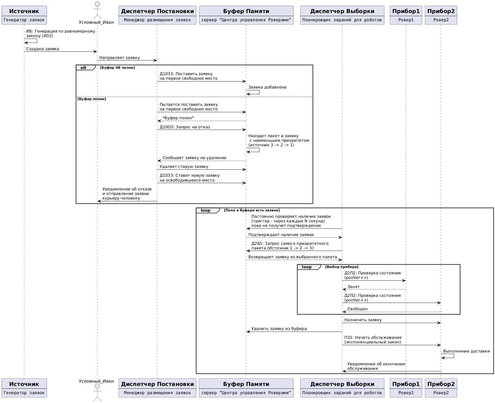

# YA.rover

Курсовая работа по предмету "Архитектура программных систем". Цель работы - смоделировать СМО - Сервис городской доставки.

## Диаграммы проекта

### 1. Sequence Diagram (Последовательность)

### 2. Class Diagram (Классы)

### 3. FlowChart (Блок-схема)

